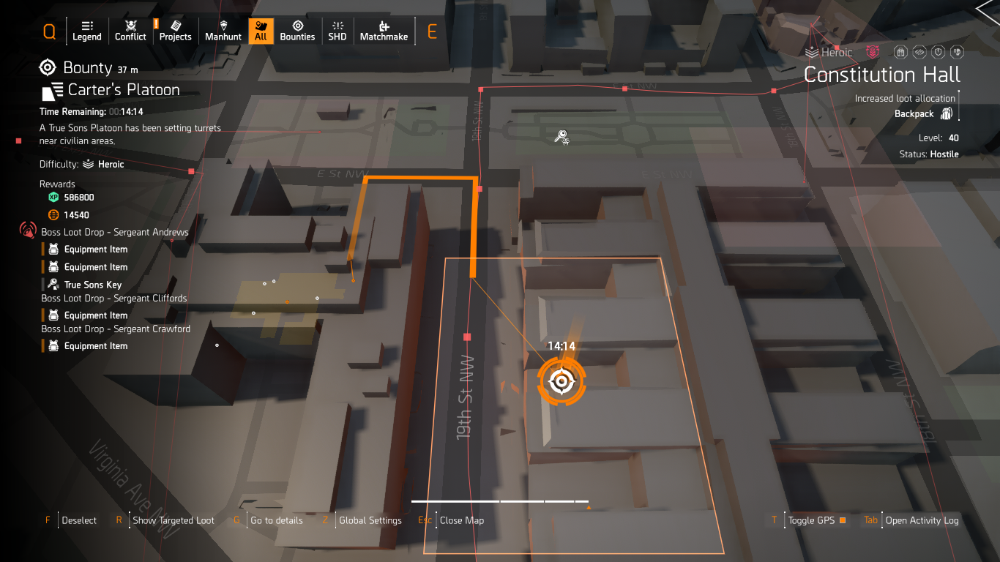
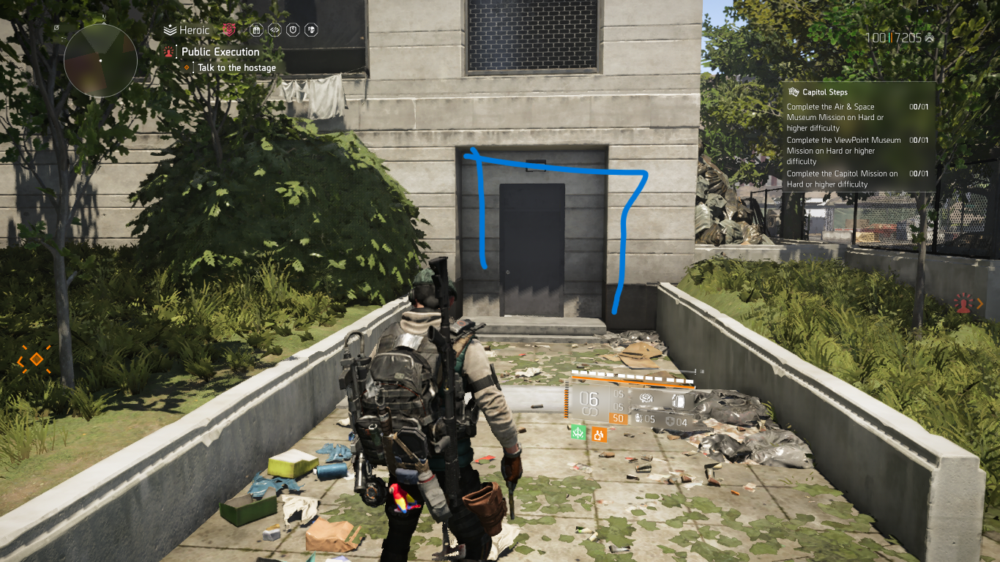
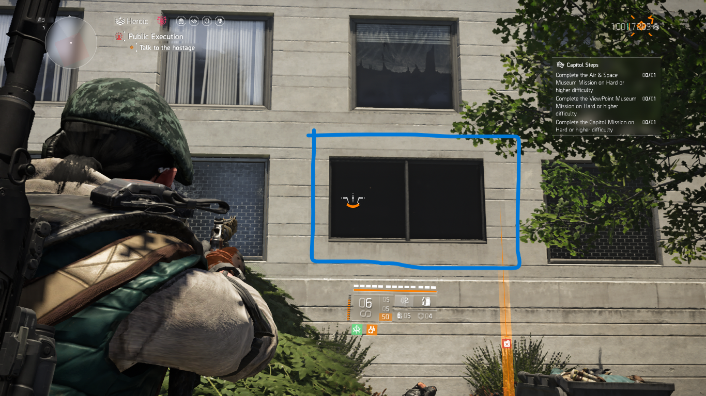

# Divison2-xp-101

## A Simple Guide To Get Started With Xp Farming For New Players
---

[Overview](#general) 
[Builds](#build) 
[Open World Activitis](Open_World_Activitis) 
[Difficulty and Directives](#general_tips_on_difficulty_and_directives) 
[Activities](Which_Activites_To_Farm) 
[Skill Tips]( Quick_Skill_Guide) 
[Faction](Faction_Consideration) 
[Spawns](#Spawns)  
---
## Overview
    Farming Xp IN Divison 2 Is Quite Simple If You Know The Know How In This Guide I Will List Few Things That I Use To Farm Xp As Efficiently As Possible. 

---     
## Build 
    Your Build Can Be One Of The Reason You Are Not Able To Get Xp Quickly.

    The Most Effective Build To Farm Xp For New Players Are : 

- Eclipse Protocol 
    4pcs Eclipse With Bag And Chest Vile Mask And 1 Electrique Pcs With Status Rolled On All The Pcs And Skill Dmg Mods Skill Haste 

    
- Headhunters Fury With D50/Regulus  
    4pcs Hunters Fury With Douglas & Harding Bag With Vigilance Talent And The Named Walker & Harris Chest Pcs Chainkiller With Perfect Headhunter All Pcs Rolled Headshot Damage And Secondry Attribute Being Weapon Hanling Mods Also Headshot Damage.You can also use memento bag in place of D&H with vigilance but replace your chest with D&H with HeadHunter.

      

### For Further Reading Check Raucey'S Build  
- [headhunter](Https://Www.Evernote.Com/Shard/S588/client/Snv?Isnewsnv=True&noteguid=Dac488Ca-A827-b49b-7b65-917751756b2C&notekey=Bf5Edc877964a987205b04cc6Ddda64a&sn=Https%3A%2F%2Fwww.Evernote.Com%2Fshard%2Fs588%2Fsh%2Fdac488Ca-A827-b49b-7b65-917751756b2C%2Fbf5Edc877964a987205b04cc6Ddda64a&title=Hunters%2Bfury%2B%2528tu18%2529) 
- [eclipse Protocol](Https://Www.Evernote.Com/Shard/S588/client/Snv?Isnewsnv=True&noteguid=8f1Fc875-172A-9331-f92e-Fe314F1772f5&notekey=Dc56508E8364ba0De3919f877C42afe8&sn=Https%3A%2F%2Fwww.Evernote.Com%2Fshard%2Fs588%2Fsh%2F8F1Fc875-172A-9331-f92e-Fe314F1772f5%2Fdc56508E8364ba0De3919f877C42afe8&title=Eclipse%2Bprotocol%2B%2528tu18%2529)
----

## Open World Activitis
    Open World Farming Is The Best Method To Level Up Shd.We Have Mainy  activities Availible In The Open World.
- Public Execution
- Teritorry Control(Elite Teritorry Control)
- Propaganda Broadcast
- Resource Convoys(Elite Resource Convoys)
- Control Points
- Warhound Convoys
- Maruders
- Bounties
 

    Xp-Chart For All Activities 

     
    credits:KiRRa
---
## General Tips On Difficulty And Directives
- Difficulty  
    The First Thing Is Difficulty I Would Advise Player After Reaching Level 40 is To Start From Hard Or Preferably Challenging Difficulty Don'T Jump Straight To Heroic As It Is Quite A Step From Challenging Difficulty.When You Are Comfortable Go On Heroic.You Can Also Jump Straight To Heroic With The Build'S Shown Above But It Is Up To You.The Xp Scale With Difficulty With Additional Modifiers Known As Directives.

- Directives 
    After Difficulty There Are Directives.They Increases Difficulty Altering How You Play For Example Ammo Hoarder With An Weapon Like Ar Can Leave You Without Ammo Fog Of War Takes Away Your Mini Map Indicator And Many More.
    
    Each Directive Increases Xp Gain By +25% You Can Have Up To 5 Directives Active So Upto 125% Xp Gain On Top Of Your Difficulty.Some Of The Easier Directives In This Season Are For The Build Mentioned Above Are Ammo Hoarder Since You Rely On Pistol And Skills It Is Not A Problem.Broken Armor Reduces Your Maximum Armor On Armor Break.
    
    For Eclipse Build It Is Better To Turn Off The Cool Skills As It Hampers Your Skills Making It Difficult To Farm.For Pistols You Can Easily Do Heroic 5 Directive.      
    

## Which Activites To Farm
- Right Now Public Executions Give The Highest Xp Per Clear Except For Bounties And Control Point But They Take Time To Clear.
    
- It Is Better Off To Do Public Execution On Repeat At Diffrent Location Or If You Have Opportunity Might Do Resource Convoy Near Public Execution As They Are Nearby And Gives A Good Chunk Of Xp And Can Be Done In Under 1 Minute With The Builds.

- Also,Don't complete weekly invaded tidal basin till near the end as the area i call xp haven is near tidal basin completig it makes  the activities dissapear  
    XP HAVEN 
    

- It Is Better To Unlock Classified Mission As They Double As Fast Travel Point Making Jumping From One Loaction To Another Faster.

- Best Bounty Location Spot(Constitution Hall) 
      

## Quick Skill Guide
- The Fire/Emp/Explosive Sticky 
    -   You Can Use This By Pressing The Skill Button And Than Aiming With It And Deploying It However This Is Not A Good Method To Use It.
    - The Best Method Is To Just Aim With An Ar At An Target And Double Pressing Skill Button To Shoot It Quickly At The Target You Are Aiming It Will Go To The Target Even You Or He Has Moved Out Of Place If You Are Quick Enough
    - Also The Stikcy Go To Wherever The Middle Of The Screen Is Aimed At For Example If You Dont Aim But The Middle Of The Screen Is Pointing At A Dog And You Double Press Skill Button It Will Go To It.

- Chem Launcher(Fire Chem) 
    - You Can Shoot Cloud To Ignite But There Is Also Other Way Of Using It  by First Placing The Cload At Destination And Double Tapping Skill Button To Ignite It Automatically.
- Firefly
    - A Good Way Of Quickly Using Firefly Is To Just Toaim With The Gun And Double Pressing Skill Button For Quick Deployment.

## Faction Consideration 
-   Helmets
    - This Is A Problem Of Determined Talent As Even Body Shotting An Enemy With An Helmet It Will Pop The Helmet First If There Is Only One Enemy Left It Is Better To  shoot Him In The Body With M870.
    -   For Heavy Enemies Like Chungas Just Pop The Helmet With M870 and Finish Them With D50/Regulus In This Way You Dispatch Them Quickly and can get your headhunter proced again. 
- Black Tusk 
    The Eclipse Fire Build Poses Some Difficulty When Dealing With Chungas And Dogs Here Is  quick Method To Deal With Them 
    
    -   Dogs 
    You Can Use A Demolisher Firefly To Quickly Dispatch Dogs.
    For More Informtion On Dealing With Dogs I Consider Watching Heller'S Dog Guide [here](Https://Www.Youtube.Com/Watch?V=N2Mb951Jwlc).

    -   Chungas 
    Breaking Their Bagpack And Shooting Them In The Broken Bag Can Dispatch Them Quickly.
    Breaking Their Chains Force Them Too Fix It Giving You Time To Deal With Them.

    - Mini Tank
    Be Careful With It As It Does Not Die Even If You Kill Its Controller And Is Quite Tanky To Deal With A Eclipse Fire Build The Only Effective Way Is Emp It Or Stay Away From Its Field Of Vision.

    - Medic Skill  
        The Medic Throw A Grenade That Emps You And Drains Your Health Dealing Him Becomes Essential As He Can Revive Dead Teammates Prolonging The Fight.

- Outcasts
    - Rusher 
      One Way Ticket To Death If He Gets Close Better To Deal With It Quickly By Shooting In The Chest Or By Shooting It First With Chem Cause They Are Nearly Insta Kill.
    - Grenade Thrower  
      Destroy His Pouch To Set Him On Fire

- True Sons
    -   Helemt With Machinegun 
        You Can Use M870 to One Shot Him Or Destroy His Belt To Reduce His Hp And Keep Him Away From Combat For A Short Period Of Time
    -  grenades 
        True Sons Grenade Is One Of The Worst Type Imo As Not Only Does It Sets You On Fire But Also Disorients You.
- Hyenas
    -   Rusher  
        Destroy His Pouch To Disorient  enemies In An Small Aoe Be Sure To Not Do It Up Close As It Disorients You Too.
---

## Spawns
Knowing The Spawns Is Crucial In This Game It Is What Good Players Take Advantage Of To Clear Content As Fast Possible I Have Few Activites And Spawns here Is A List Of Few Spawns On Locations I Farm The Most.    

-  West END near Classified Mission

    - Location  
     
     

    - Spawns
    	  
- Near Tidal Basin
    - Loacation A 
	  

	    - Spawns(Either One Of Them) 
      
	  

    - Location B 
      
        - Spawns
	     

    - Location C 
     
        - Spawns  
	      
- Near DZ East Checkpoint
    - Location 
	  
	 
        - Spawns  
	  
- Near Air and Space Museum
    - Loacation  
	  

	- Spawns(Either One Of Them) 
      
	  

    - Loacation  
	  

	    - Spawns(Either One Of Them) 
      
	 
       

    - Loacation  
	  

	    - Spawnsp 
     
 
