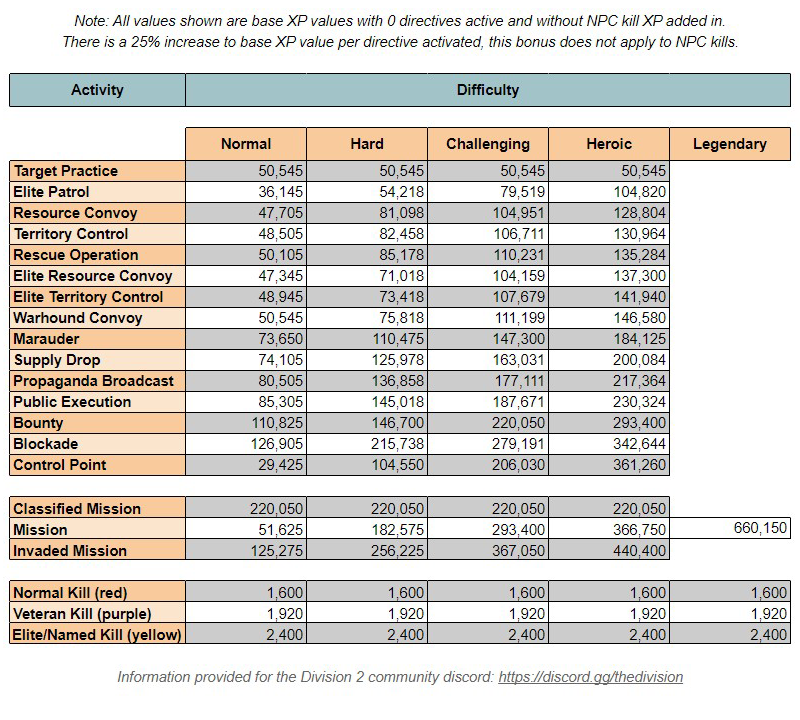
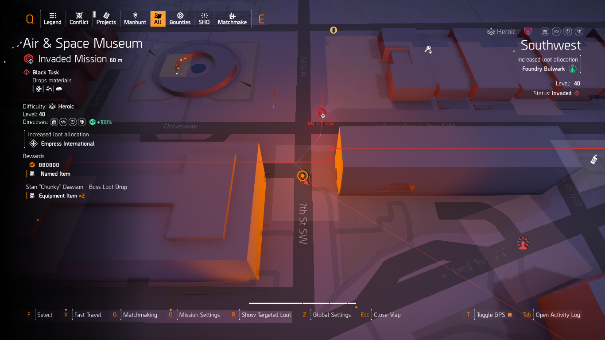

# Division 2 XP 101

## A Simple Guide To Get Started With XP Farming For New Players

***Table of Contents:***  

- [Overview](#overview)
- [Builds](#builds)
- [Open World Activities](#open-world-activities)
- [Difficulty and Directives](#general-tips-on-difficulty-and-directives)
- [Activities](#which-activities-to-farm)
- [Skill Tips](#quick-skill-guide)
- [Faction](#faction-consideration)
- [Spawns](#spawns)

-----

## Overview

Farming XP in Division 2 is quite simple if you know how to. In this guide, I will list a few tips I have for farming XP as efficiently as possible.

## Builds

Having good farming builds is key to farming XP quickly.

The most effective builds for new players looking to farm XP are:

- **Eclipse Protocol** ([Raucey's guide](https://www.evernote.com/shard/s588/client/snv?isnewsnv=true&noteGuid=8f1fc875-172a-9331-f92e-fe314f1772f5&noteKey=dc56508e8364ba0de3919f877c42afe8&sn=https%3A%2F%2Fwww.evernote.com%2Fshard%2Fs588%2Fsh%2F8f1fc875-172a-9331-f92e-fe314f1772f5%2Fdc56508e8364ba0de3919f877c42afe8&title=Eclipse%2BProtocol%2B%2528TU18%2529))
  - 4pcs Eclipse Protocol with bag and chest
  - Vile mask
  - 1pc Electrique/Golan Gear  
  - All pieces have *Status Effects* and *Skill Damage* rolled, mods are *Skill Haste*

   
- **Headhunter's Fury With D50/Regulus** ([Raucey's guide](https://www.evernote.com/shard/s588/client/snv?isnewsnv=true&noteGuid=a7f5c11a-6dfd-226c-836b-18e272395d1c&noteKey=44191b2cdedaa56a2ada9a1d98cefe71&sn=https%3A%2F%2Fwww.evernote.com%2Fshard%2Fs588%2Fsh%2Fa7f5c11a-6dfd-226c-836b-18e272395d1c%2F44191b2cdedaa56a2ada9a1d98cefe71&title=Regulus%2BHeadhunter%2B%2B%2528TU18%2529))
  - 4pcs Hunter's Fury  

  Pick between:
  - Chainkiller (Named Walker & Harris Co. chestpiece with Perfect Headhunter)
  - Douglas & Harding backpack with Vigilance

  ***or***
  - Douglas & Harding chestpiece with Headhunter
  - Memento

    

-----

## Open World Activities

Open world farming is the best method to level up SHD. We have many activities available in the open world.

- Public Execution
- Territory Control (Elite Territory Control)
- Propaganda Broadcast
- Resource Convoys (Elite Resource Convoys)
- Control Points
- Warhound Convoys
- Marauders
- Bounties

### XP chart for all activities

-----

## General Tips On Difficulty And Directives

### Difficulty  

I would advise players after reaching level 40 to get to Challenging, but not Heroic, as it is too tough without even some minimal farming. When comfortable, move to Heroic. You may use the [builds presented in this guide](#builds) for Heroic.

### Directives

Directives are an additional level of challenge on top of Difficulty. They give you debuffs, altering your playstyle. For example:

- Ammo Hoarders significantly decreases your ammo capacity, makes you lose loaded ammo on reload, and prevents enemies from dropping ammo on death,
- Fog of War Revisited disables your minimap,
- Broken Armor reduces your max armor upon armor break which you have to undo with armor kits,
- etc.

Each Directive increases your **activity XP gain** by 25%. You may have up to 5 Directives active in the open world, for 125% activity XP gain. In this season (TU18), the [builds mentioned above](#builds) can tackle them well:

- Eclipse Protocol can counter Ammo Hoarders, but will find a hard time countering the skills-based directives. It is easier to play however.
- Headhunter's Fury can counter Ammo Hoarders and skills-based directives. It can survive in 5 Directives the easiest compared to EP.

## Which Activities To Farm

- Right Now Public Executions Give The Highest Xp Per Clear Except For Bounties And Control Point But They Take Time To Clear.

- It Is Better Off To Do Public Execution On Repeat At Diffrent Location Or If You Have Opportunity Might Do Resource Convoy Near Public Execution As They Are Nearby And Gives A Good Chunk Of Xp And Can Be Done In Under 1 Minute With The Builds.

- Also,Don't complete weekly invaded tidal basin till near the end as the area i call xp haven is near tidal basin completig it makes  the activities dissapear  
    XP HAVEN 
    

- It Is Better To Unlock Classified Mission As They Double As Fast Travel Point Making Jumping From One Loaction To Another Faster.

- Best Bounty Location Spot(Constitution Hall) 
     

## Quick Skill Guide

- The Fire/Emp/Explosive Sticky 
  - You Can Use This By Pressing The Skill Button And Than Aiming With It And Deploying It However This Is Not A Good Method To Use It.
  - The Best Method Is To Just Aim With An Ar At An Target And Double Pressing Skill Button To Shoot It Quickly At The Target You Are Aiming It Will Go To The Target Even You Or He Has Moved Out Of Place If You Are Quick Enough
  - Also The Stikcy Go To Wherever The Middle Of The Screen Is Aimed At For Example If You Dont Aim But The Middle Of The Screen Is Pointing At A Dog And You Double Press Skill Button It Will Go To It.

- Chem Launcher(Fire Chem) 
  - You Can Shoot Cloud To Ignite But There Is Also Other Way Of Using It  by First Placing The Cload At Destination And Double Tapping Skill Button To Ignite It Automatically.
- Firefly
  - A Good Way Of Quickly Using Firefly Is To Just Toaim With The Gun And Double Pressing Skill Button For Quick Deployment.

## Faction Consideration

- Helmets
  - This Is A Problem Of Determined Talent As Even Body Shotting An Enemy With An Helmet It Will Pop The Helmet First If There Is Only One Enemy Left It Is Better To  shoot Him In The Body With M870.
  - For Heavy Enemies Like Chungas Just Pop The Helmet With M870 and Finish Them With D50/Regulus In This Way You Dispatch Them Quickly and can get your headhunter proced again.
- Black Tusk 
    The Eclipse Fire Build Poses Some Difficulty When Dealing With Chungas And Dogs Here Is  quick Method To Deal With Them 

  - Dogs 
    You Can Use A Demolisher Firefly To Quickly Dispatch Dogs.
    For More Informtion On Dealing With Dogs I Consider Watching Heller'S Dog Guide [here](Https://Www.Youtube.Com/Watch?V=N2Mb951Jwlc).

  - Chungas 
    Breaking Their Bagpack And Shooting Them In The Broken Bag Can Dispatch Them Quickly.
    Breaking Their Chains Force Them Too Fix It Giving You Time To Deal With Them.

  - Mini Tank
    Be Careful With It As It Does Not Die Even If You Kill Its Controller And Is Quite Tanky To Deal With A Eclipse Fire Build The Only Effective Way Is Emp It Or Stay Away From Its Field Of Vision.

  - Medic Skill  
        The Medic Throw A Grenade That Emps You And Drains Your Health Dealing Him Becomes Essential As He Can Revive Dead Teammates Prolonging The Fight.

- Outcasts
  - Rusher 
      One Way Ticket To Death If He Gets Close Better To Deal With It Quickly By Shooting In The Chest Or By Shooting It First With Chem Cause They Are Nearly Insta Kill.
  - Grenade Thrower  
      Destroy His Pouch To Set Him On Fire

- True Sons
  - Helemt With Machinegun 
        You Can Use M870 to One Shot Him Or Destroy His Belt To Reduce His Hp And Keep Him Away From Combat For A Short Period Of Time
  - grenades 
        True Sons Grenade Is One Of The Worst Type Imo As Not Only Does It Sets You On Fire But Also Disorients You.
- Hyenas
  - Rusher  
        Destroy His Pouch To Disorient  enemies In An Small Aoe Be Sure To Not Do It Up Close As It Disorients You Too.

---

## Spawns

Knowing The Spawns Is Crucial In This Game It Is What Good Players Take Advantage Of To Clear Content As Fast Possible I Have Few Activites And Spawns here Is A List Of Few Spawns On Locations I Farm The Most.

- West END near Classified Mission

  - Location  
     
    

  - Spawns
      
- Near Tidal Basin
  - Loacation A 
  

    - Spawns(Either One Of Them) 
     
  

  - Location B 
     
    - Spawns
      

  - Location C 
     
    - Spawns 
      
- Near DZ East Checkpoint
  - Location 
  
  
    - Spawns 
  
- Near Air and Space Museum
  - Loacation  
  

  - Spawns(Either One Of Them) 
     
  

  - Loacation  
  

    - Spawns(Either One Of Them) 
     
  
       

  - Loacation  
  

    - Spawnsp 
     
